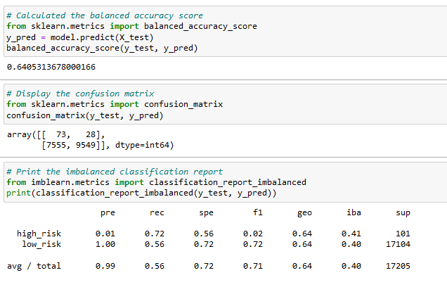
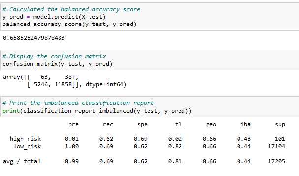
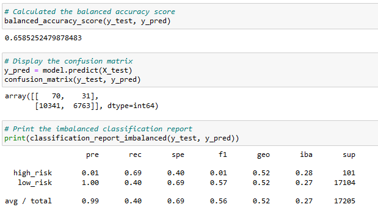
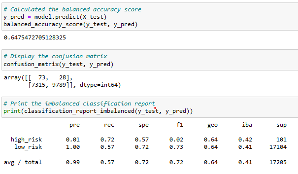
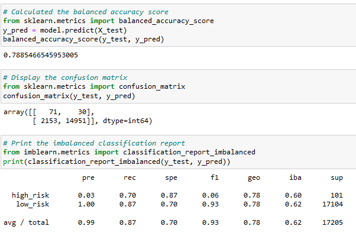
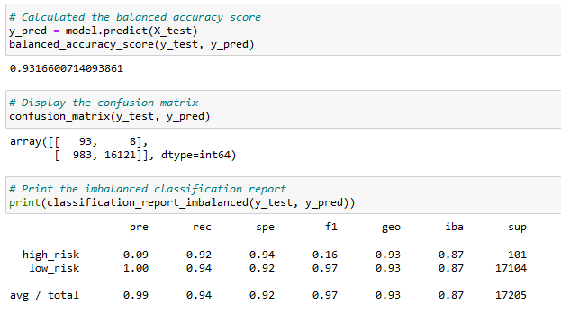

# Credit_Risk_Analysis - Module 17 Challenge 
# Supervised Machine Learning
## Overview of the Analysis

The purpose of this analysis is to determine what technique is best used to analyze credit risk - using various methods of over and under sampling and other Machine Learning algorithms.

## Resources Used
- Data Source: LoanStats_2019Q1.csv
- Software: Python 3.7.6, Visual Studio Code 1.63.2, Conda 4.11.0, Jupyter Notebook 6.4.6, SkLearn

## Results

Six machine learning models were used to process the data, Naive Random Oversampling, SMOTE Oversampling, Cluster Centroid Undersampling, SMOTEEN Combined Sampling, Balanced Random Forest Classifier and Easy Ensemble AdaBoost Classifier. The results of those tests are as follows.

- #### Naive Random Oversampling
    - 
    - Based on the image, the balanced accuracy score is 64%, the precision is 1%, and the recall is 72%
- #### SMOTE Oversampling
    - 
    - Based on the image, the balanced accuracy score is 66%, the precision is 1%, and the recall is 62%
- #### Cluster Centroids Undersampling
    - 
    - Based on the image, the balanced accuracy score is 66%, the precision is 1%, and the recall is 69%
- #### SMOTEENN
    - 
    - Based on the image, the balanced accuracy score is 65%, the precision is 1%, and the recall is 72%
- #### Random Forest Classifier
    - 
    - Based on the image, the balanced accuracy score is 79%, the precision is 3%, and the recall is 70%
- #### Easy Ensemble AdaBoost Classifier
    - 
    - Based on the image, the balanced accuracy score is 93%, the precision is 9%, and the recall is 92%

## Summary

Overall, the results showed the best accuracy, precision and recall scores for the Easy Ensemble AdaBoost Classifier. Many of the tests were very imprecise at predicting the high risk accounts based on the data, many of them showing a precision of approximately 1%. This may indicate the unpredictablility of discovering credit risk, but can also mean there could be other data missing that can help improve all the scores.

### Reccomendation for Future Work
While the Easy Ensemble AdaBoost Classifier may show the best scores, I would reccomend not choosing any model at this time, or at least first evaluating the models with a financial professional. Each method makes various assumptions about how it processes the data, and these assumptions and what data the system may deem more important should be analyzed with someone experienced with the raw data contained in the file.

Once the outputs have been looked at by someone more familiar with the data to support the findings, they can move forward with using the AdaBoost method for the higher accuracy, precision and recall.
